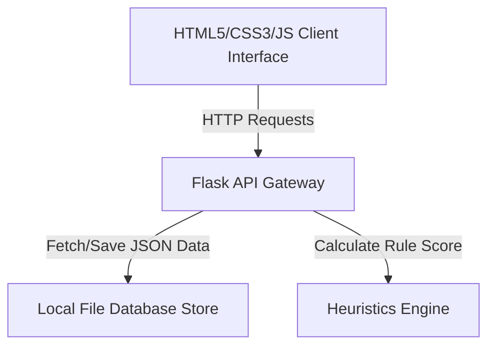

# PhishGuard SOC Platform: Comprehensive Overview & Guide

---

## 1. Executive Summary
The **PhishGuard SOC (Security Operations Center) Platform** is an enterprise-grade dashboard designed for modern security teams to detect, triage, analyze, and manage phishing threats. By combining real-time incident tracking with an automated sandbox heuristics analysis scanner and regulatory compliance scoring, it serves as a centralized hub for managing an organization's email threat landscape.

---

## 2. Core Purpose of the Dashboard
The dashboard serves three primary purposes:

### A. Centralized Threat Triage (Incident Management)
It aggregates suspicious emails reported by employees or caught by email gateways. Analysts can track incidents sequentially, prioritizing them by risk level (Critical, High, Medium, Low) and updating their mitigation status (Open, Investigating, Contained, Resolved).

### B. Automated Sandbox Analysis (Heuristics Engine)
Instead of manually inspecting raw headers and links, the built-in **Phishing Analyzer Sandbox** scans email metadata, bodies, and URLs against a set of advanced detection rules (typosquatting detection, credential requests, public webmails, suspicious file extensions). It computes a final **Aggregated Suspicion Threat Score (0–100)** and outputs a detailed **AI Sandbox Copilot Verdict** recommendation card.

### C. Compliance & Security Governance Posture
The platform maps active threat vectors against standard regulatory frameworks (like **ISO 27001**, **SOC 2 Type II**, **NIST CSF v2.0**, and **CIS Critical Controls**). It calculates a dynamic overall posture score to ensure organizational compliance audits remain on track.

---

## 3. Why Host it Online? (The Value of Deployment)
Hosting this application in the cloud (such as on Render) rather than running it locally on a single desktop provides significant operational benefits:

* **Remote Access:** Security analysts can log in and manage security alerts from anywhere, whether they are in the office or working remotely, without needing to run code locally.
* **Centralized database (Single Source of Truth):** When the database (`data/incidents.json`) is hosted on a cloud server, any analyst who creates, updates, or resolves an incident immediately updates the dashboard for the entire team in real-time.
* **Collaboration & Audit Logging:** Multi-person security teams can view and log actions, generating a unified **Platform Audit Log** exported easily to JSON for external compliance reporting.
* **API Integrations:** Hosting the backend enables external tools (like corporate email servers, Microsoft Outlook add-ins, or Slack webhooks) to automatically send suspicious emails to `POST /api/incidents` for analysis.
* **Portfolio & Demo Capability:** Having a live link (`onrender.com`) is a great showcase of a fully functioning, responsive client-server web application for security demonstrations and presentations.

---

## 4. Who Can Use the Dashboard & For What?

| User Role | How They Use the Platform | Key Features Used |
| :--- | :--- | :--- |
| **Security Analyst (Tier 1/2)** | Triage reported alerts, run sandbox checks on suspicious files/links, and follow Mitre Att&ck vectors to block active hostnames. | Incident List, Sandbox Analyzer, Mitre Attack Mapping, Attack Chain Visualizer |
| **SOC Operations Manager** | Monitor active threat levels, manage analyst assignments, review performance logs, and review platform audits. | KPI Metric Cards, Workspace Selector, System Diagnostics, Export Audit Logs |
| **Compliance & IT Auditor** | Check if corporate controls meet ISO 27001 and SOC 2 requirements, identify open vulnerabilities, and verify awareness training metrics. | Posture Circle Gauge, Regulatory Audit Summary, Active Frameworks list |
| **End Employees / Users** | Report suspicious emails easily by sending headers to the dashboard backend for verification. | Manual Incident Logging (Quick Action Form) |

---

## 5. Technical Architecture Overview

The system is built using a modern **Client-Server (Three-Tier)** architecture:

1. **Frontend (Presentation Layer):** HTML5, Vanilla CSS3 (with custom dark mode variables, glassmorphism, and responsive keyframe animations), and JavaScript. Uses Lucide Icons for high-fidelity security symbols.
2. **Backend (Application Layer):** Python Flask server serving APIs (`/api/incidents`, `/api/stats`, `/api/compliance`, `/api/analyze`) and static assets.
3. **Database (Data Persistence Layer):** JSON flat-file storage (`data/incidents.json`, `data/stats.json`, `data/compliance.json`) representing a lightweight, serverless database that persists entries permanently on Render or local disks.

---

## 6. How to Export this Document to PDF
If you need to print this guide or submit it as a PDF document, you can:
1. Open the file in VS Code, install the **"Markdown PDF"** extension, right-click, and select **Export to PDF**.
2. Run your dashboard on your browser, click on the raw file view, right-click anywhere, and select **Print -> Save as PDF**.
